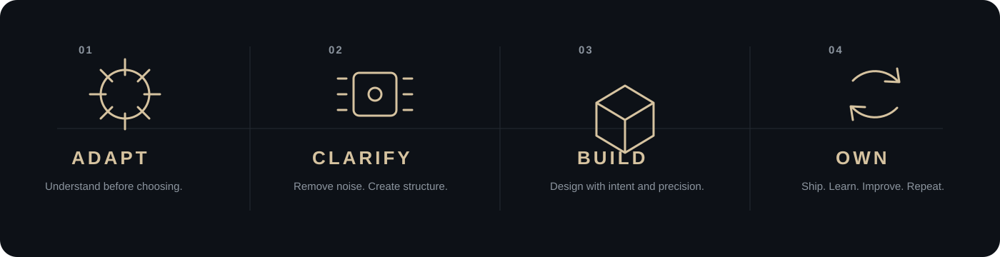
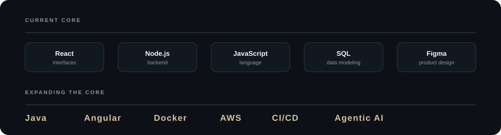
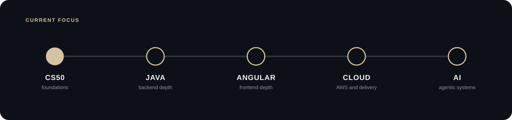

  

  
  
  

  Based in France · Building for an international career

 

About

I am Benjamin, a full stack developer with a product mindset.

I like understanding the whole system. Product design, data, backend, frontend, delivery and the details that make software easier to understand.

Today I build mainly with React and Node.js. I am growing into Java, Angular, cloud engineering, CI/CD and applied AI.

My goal is simple: build useful software, understand what sits underneath it, and keep raising the level.

 

How I Think

  

 

Engineering

  

I care about readable code, explicit structure, meaningful errors and systems that remain understandable as they grow.

 

Current Focus

  

  <strong>Learn · Build · Ship · Review · Improve</strong>

 

Selected Builds

<table>
<tr>
<td width="33%" valign="top">

01 / Flagship SaaS

A complete SaaS product built as a real software system.

Java Angular SQL AWS

Status: Planned

</td>
<td width="33%" valign="top">

02 / Agentic Product

AI inside a real workflow with tools, APIs and business logic.

AI Automation APIs Cloud

Status: Planned

</td>
<td width="33%" valign="top">

03 / Backend Lab

A backend project focused on architecture, errors, testing and clarity.

Java API Design Testing

Status: Planned

</td>
</tr>
</table>

 

Beyond Code

<table>
<tr>
<td width="52%" valign="middle">

Photography taught me to slow down and look closer.

Composition. Detail. Contrast. Perspective.

The same instinct follows me into software. Understand what matters. Remove noise. Keep what adds value.

</td>
<td width="48%" valign="middle">

</td>
</tr>
</table>

 

Connect

  <strong>BenjaminCore</strong> 
  Full Stack Developer · Product Builder  
  Open to ambitious projects, international opportunities and collaborations.

  <strong>Adapt · Build · Refine</strong>

