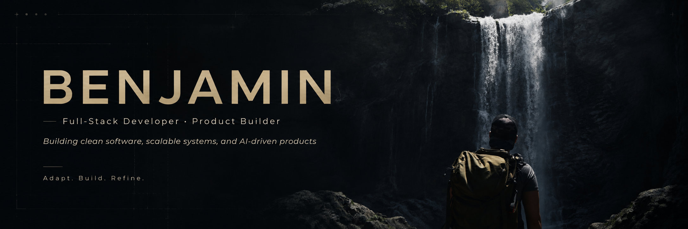
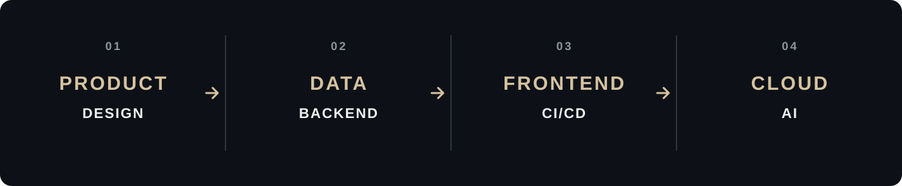
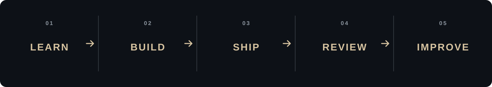
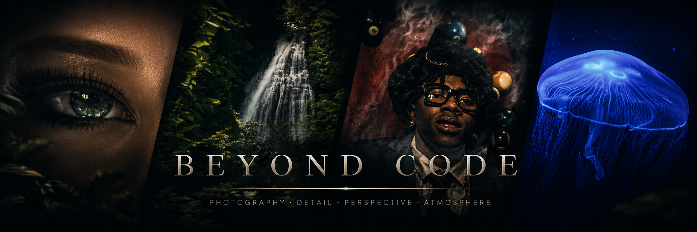

  

  <strong>Based in France · Building for an international career</strong> 
  Full stack developer focused on thoughtful products, clean systems and continuous learning.

  

<!--
CONNECT BUTTONS

Replace the URLs, then remove the surrounding comment.

  
  
  

-->

 

## About

### I'm Benjamin, a full stack developer with an end to end mindset.

I like understanding a product as a whole, from **Figma and data modeling** to **backend architecture, frontend development and delivery**.

Today I build mainly with **React and Node.js**. I'm deliberately growing into **Java, Angular, cloud engineering, CI/CD and agentic AI**.

I care about software that is easy to read, easy to reason about and built with purpose.

> **Software should be understandable before it is impressive.**

 

## How I Think

### 01. Adaptability
Understand the problem first. Adapt the tools to the context.

### 02. Clarity
Make code, architecture and errors easy to understand.

### 03. Product Thinking
Build for the person using the product, not just for the codebase.

### 04. Ownership
Think beyond implementation. Ship, observe and improve.

 

## From Idea to Delivery

  

I want to understand the full lifecycle of modern software.

The goal is not to collect technologies. The goal is to understand **how the pieces interact**.

 

## Working With

  
  
  
  
  
  

### Building Toward

  
  
  
  
  

 

## Current Learning Path

| Focus | Direction | Status |
|---|---|---|
| Computer Science Fundamentals | Harvard CS50 | **In progress** |
| Backend Engineering | Java ecosystem | **Deepening** |
| Frontend Engineering | Angular | **Deepening** |
| Java Certification | Oracle certification path | **Planned** |
| Cloud Engineering | AWS certification path | **Planned** |
| Delivery | CI/CD and deployment | **Project based** |
| Applied AI | Agents and real world AI workflows | **Exploring and building** |

  

 

## Learning Projects

### I learn best by building complete applications, not isolated exercises.

These projects come from guided learning. I use them to explore new technologies, understand complete application flows and then improve the result through my own decisions.

### 01. AI Calorie Tracker

**Full Stack Mobile Application**

A guided project focused on building a complete AI powered calorie tracking application, from mobile development and authentication to database integration, background jobs and image analysis.

`React Native` · `Expo` · `OpenAI` · `PostgreSQL` · `Clerk` · `Trigger.dev` · `Sentry`

**Reference tutorial:** [burakorkmez/cal-ai-tutorial](https://github.com/burakorkmez/cal-ai-tutorial)

### 02. Project Management Platform

**Full Stack Web Application**

A guided project management platform used to deepen my understanding of application structure, authentication, data validation, frontend and backend communication, and complete product workflows.

`React` · `TypeScript` · `React Router` · `Tailwind CSS` · `Node.js` · `Express` · `MongoDB`

The project also gives me a practical environment to work with authentication, validation and application security.

**Reference tutorial:** [CodeWaveWithAsante/project-manager](https://github.com/CodeWaveWithAsante/project-manager)

 

## What I'm Building Toward

### These are ideas I want to turn into complete, useful products.

The objective here is different from my learning projects. These products start from my own ideas, product decisions and design work.

### 01. Cupsy

**Coffee Shop Experience & Ordering Platform**

Cupsy is a full stack platform designed around the complete customer journey of a modern independent coffee shop.

The project starts from an original brand identity I designed myself in Illustrator, including the logo, mascot, typography, color palette and visual direction.

Cupsy would connect three experiences around the same backend:

**Customer Experience**  
A public application where customers can discover the café, explore the menu, create an account, view previous orders and follow their loyalty points.

**In Store Kiosk**  
A touch friendly tablet experience inspired by modern self ordering kiosks. Customers can browse categories, customize products, order as a guest or connect to their Cupsy account, redeem rewards and receive an order number.

**Administration**  
A lightweight interface for managing products, categories, availability, customer orders, loyalty rules and basic activity insights.

The loyalty system would keep a real transaction history instead of only storing a points balance. This makes rewards traceable and gives the backend more meaningful business logic.

The ordering workflow would also be built around explicit states such as `CREATED`, `CONFIRMED`, `PREPARING`, `READY`, `COMPLETED` and `CANCELLED`.

I want Cupsy to be a project where product design and software engineering meet. The goal is to move from **brand identity to UX, data modeling, backend, frontend and deployment** inside one coherent product.

`Angular` · `Java` · `Spring Boot` · `PostgreSQL`

**Later:** `CI/CD` · `AWS` · `Docker`

**Planned scope:** dynamic menu · customer accounts · product customization · ordering kiosk · loyalty points · rewards · order tracking · administration

### 02. LensDesk

**Workspace for Photographers**

A lightweight SaaS designed around photographers and the way they manage clients, shoots and deliveries.

The product would focus on a simple workflow connecting customer information, upcoming sessions, notes, delivery status and project history.

It gives me a way to turn a world I already know through photography into a real software product.

`Angular` · `Java` · `Spring Boot` · `PostgreSQL`

**Planned scope:** clients · shoots · notes · delivery tracking · project status · simple dashboard

### 03. FlowAI

**AI Assisted Task Organizer**

A focused application exploring how AI can turn natural language into structured and actionable work.

A user could describe what needs to be done in plain language. The system would return a structured proposal with tasks, priorities, possible subtasks and useful context.

The user stays in control by reviewing and editing the suggestion before anything is saved.

`Angular` · `Java` · `Spring Boot` · `OpenAI` · `PostgreSQL`

**Core flow:** user input · AI suggestion · human validation · structured task creation

The first version stays intentionally simple. More advanced agentic behavior can come later as my understanding grows.

 

## Core Principles

### Readable by default
Code should be easy to follow before it is clever.

### Errors should explain
A failure should help the next person understand what happened.

### Architecture should serve the product
Structure exists to keep change safe and software understandable.

### Automation should remove repetition
If a reliable process can be automated, automate it.

### AI should earn its place
Use it where it creates real value for the product or workflow.

 

## Beyond Code

  

Photography is one of the ways I train my eye for **composition, detail, contrast and perspective**.

I bring the same mindset into software. Understand what matters. Remove noise. Keep what adds value.

 

  <strong>Adapt. Build. Refine.</strong> 
  One system, one product, one iteration at a time.

